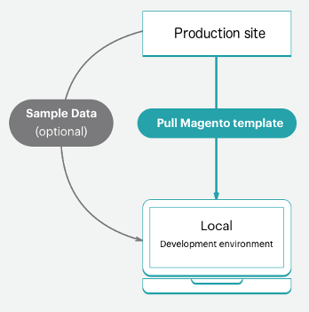

# Flujo de trabajo de proyecto inicial

Adobe Commerce en la infraestructura de la nube incluye un único repositorio Git con una rama `master` para el entorno de producción que se puede bifurcar para crear entornos de ensayo y de integración múltiple para el trabajo de prueba y desarrollo. Puede tener hasta cuatro entornos activos, incluido un entorno `master` para el servidor de producción. Consulte [Arquitectura inicial](starter-architecture.md) para obtener una descripción general.

Para sus entornos, siga el flujo de trabajo [!UICONTROL Development > Staging > Production] para desarrollar e implementar su sitio.

- **Entorno de producción (sitio activo)**: proporciona un entorno de producción completo con todos los servicios creados e implementados a partir del código en la rama `master`.
- **Entorno de ensayo**: proporciona un entorno de ensayo completo que coincide con el entorno de producción con todos los servicios creados e implementados desde una rama `staging` que usted crea mediante la clonación de `master`.
- **Entornos de integración**: proporciona hasta dos entornos de desarrollo activos que crea a partir de la rama `staging`. El entorno `integration` no admite servicios de terceros como Fastly y New Relic.

Para sus ramas, puede seguir cualquier metodología de desarrollo. Por ejemplo, puede seguir una metodología Agile como scrum para crear ramas para cada sprint.

Desde cada sprint, puede crear ramas para cada historia de usuario. Todas las historias se vuelven comprobables. Puede combinar continuamente con la rama de sprint y validar esa rama de forma continua. Cuando finalice el sprint, puede combinar la rama de sprint con `master` para implementar todos los cambios de sprint en producción sin tener que lidiar con un cuello de botella de prueba.

## Flujo de trabajo de desarrollo

El desarrollo y la implementación en planes Starter comienzan con su proyecto inicial. El proyecto se crea con el &quot;sitio en blanco&quot;, que es un repositorio de código de plantilla de Adobe Commerce en la infraestructura de la nube con una tienda completamente preparada. Esto crea una rama `master` con una copia del código del entorno de producción.

El flujo de trabajo de desarrollo incluye lo siguiente:

- [Clonar y bifurcar](#clone-and-branch) desde `master` para crear `staging` y ramas de desarrollo
- [Desarrollar código](#develop-code) e instalar extensiones localmente en una rama de desarrollo, incluidas [!DNL Composer] actualizaciones
- [Configurar](#configure-store) la configuración de tu tienda y extensión
- [Generar archivos de administración de configuración](#generate-configuration-management-files)
- [Código push](#push-code-and-test) y configuración para generar e implementar en los entornos `staging` y `production`


También tiene algunos pasos opcionales para ayudarle a desarrollar y probar el código y los datos de la tienda:

- [Instalar datos de ejemplo](#optional-install-sample-data) en su tienda
- [Extraer datos del almacén de producción](#optional-pull-production-data) a entornos

Este proceso supone que has configurado tu [espacio de trabajo para desarrolladores local](../development/overview.md).

### Clonar y bifurcar

Para un nuevo proyecto de plan inicial, se clonó una rama `master` del repositorio Git de Adobe Commerce en la infraestructura de la nube. Para empezar a ramificar y trabajar con código, clone la rama `master` en el entorno local.

El formato del comando Git clone es el siguiente:

```bash
git fetch origin
```

```bash
git pull origin <environment-ID>
```

La primera vez que empiece a trabajar en ramas para el proyecto de inicio, cree una rama `staging`. Esto crea una rama de código que coincide con la rama `master` que se implementa en un entorno de ensayo para probar los cambios de configuración y código antes de implementarlos en el entorno de producción.

A continuación, cree ramas a partir de `staging` para desarrollar código, agregar extensiones y configurar integraciones de terceros. Cada vez que desarrolle código personalizado, agregue extensiones, integre un servicio de terceros y trabaje en una rama de desarrollo creada a partir de la rama `staging`. Tiene cuatro entornos de integración activos disponibles. Al insertar una rama activa, uno de estos entornos de integración implementa automáticamente el código para probarlo.

El formato del comando de rama Git es el siguiente:

```bash
git checkout <branch-name>
```

El formato del comando `branch` de CLI de nube es el siguiente:

```bash
magento-cloud environment:branch <environment-name> <parent-environment-ID>
```


### Desarrollar código

Con la rama base de Adobe Commerce en el código de infraestructura en la nube, puede empezar a instalar extensiones, desarrollar código personalizado, agregar temáticas y mucho más.

Utilice una estrategia de ramificación con el trabajo de desarrollo. El uso de una rama para realizar todo el trabajo a la vez puede dificultar las pruebas. Por ejemplo, puede seguir las metodologías de integración continua y sprint para funcionar:

- Añada algunas extensiones y configúrelas con la primera rama
- Inserte este código, pruebe y combine en Ensayo y luego en Producción
- Configure completamente sus servicios en `services.yaml` y agregue un tema
- Inserte este código, pruebe y combine en Ensayo y luego en Producción
- Integración con un servicio de terceros
- Inserte este código, pruebe y combine en Ensayo y luego en Producción

Hasta que su tienda esté completamente creada, configurada y lista para iniciarse. Pero sigue leyendo, hay muchas opciones para tu tienda y configuración de código.

>[!NOTE]
>
>No complete todavía ninguna configuración en su estación de trabajo local.


### Configurar tienda

Cuando esté listo para configurar su tienda, inserte todo el código en el entorno `integration`. Configure los ajustes de la tienda desde el administrador para el entorno de integración, no en el entorno local. Para encontrar la dirección URL, haga clic en **Acceder al sitio** en [!DNL Cloud Console]

Para obtener la mejor información sobre las configuraciones, consulte la documentación de Adobe Commerce y las extensiones instaladas. A continuación se muestran algunos vínculos e ideas que le ayudan a empezar:

- [Prácticas recomendadas para la configuración de tiendas](../store/best-practices.md) para prácticas recomendadas específicas en la nube
- [Configuración básica](https://experienceleague.adobe.com/es/docs/commerce-admin/start/setup/store-details) para acceso de administrador de tienda, nombre, idiomas, divisas, marca, sitios, vistas de tienda y mucho más
- [Tema](https://experienceleague.adobe.com/es/docs/commerce-admin/content-design/content-menu#design-features) por tu aspecto del sitio y de las tiendas, incluyendo CSS y diseños
- [Configuración del sistema](https://experienceleague.adobe.com/es/docs/commerce-admin/systems/guide-overview) para funciones, herramientas, notificaciones y la clave de cifrado de la base de datos
- Configuración de extensión mediante su documentación

Más allá de la configuración de tienda, puede configurar varios sitios y tiendas, servicios configurados y mucho más. Ver [Configurar tu tienda](../store/overview.md).

### Generar archivos de administración de configuración

Si está familiarizado con Adobe Commerce, puede que le preocupe cómo obtener los ajustes de configuración de la base de datos en los entornos de desarrollo, ensayo y producción. Anteriormente, tenía que copiar todos los ajustes de configuración en papel o en un archivo y, a continuación, aplicarlos manualmente a otros entornos. O puede que haya volcado su base de datos y haya insertado esos datos en otro entorno.

Adobe Commerce en la infraestructura en la nube proporciona un conjunto de dos comandos de [administración de configuración](../store/store-settings.md) que exportan la configuración de su entorno a un archivo. Estos comandos sólo están disponibles para **Adobe Commerce en la nube 2.2 y versiones posteriores**.

- `php .vendor/bin/ece-tools config:dump`: Exporta sólo los valores de configuración que haya introducido o modificado a partir de los valores predeterminados a un archivo de configuración. _Recomendado_.
- `php bin/magento app:config:dump`: exporta todas las opciones de configuración, incluidas las modificadas y las predeterminadas, a un archivo de configuración.

El archivo generado es `app/etc/config.php`.

Genere el archivo en el entorno de integración donde configuró Adobe Commerce. Siga el proceso de generación del archivo, agregarlo a la rama e implementarlo.

**Notas importantes** sobre la administración de la configuración:

- Cualquier configuración incluida en el archivo generado a partir del comando `app:config:dump` no se puede editar, o es de solo lectura, en el entorno implementado. Esta es una de las razones por las que el Adobe recomienda usar el comando `.vendor/bin/ece-tools config:dump`.

  Por ejemplo, puede instalar un módulo para Fastly en su entorno de desarrollo. Solo puede configurar este módulo en el entorno de ensayo y producción. El uso del comando `.vendor/bin/ece-tools config:dump` mantiene editables esos campos predeterminados al implementar los cambios de desarrollo en el entorno de ensayo y producción.

- El archivo generado puede ser largo en función del tamaño de la implementación. El comando `.vendor/bin/ece-tools config:dump` genera un archivo más pequeño que el archivo generado por el comando `app:config:dump`.

Si utiliza la versión 2.2 o posterior de Adobe Commerce, los comandos de administración de configuración proporcionan una función adicional para proteger los datos confidenciales, como las credenciales de la zona protegida para un módulo de PayPal. Durante el proceso de exportación, los valores que contengan datos confidenciales se exportarán a un archivo de configuración independiente: `env.php` en el directorio `app/etc/`. Este archivo permanece en su entorno local y no se copia cuando inserta el código en otra rama. También puede crear variables de entorno con comandos CLI en todas las versiones de infraestructura en la nube de Adobe Commerce.


Consulte [Administración de configuración](../store/store-settings.md).

### Código push y prueba

En este punto, debería tener una rama de código desarrollada con un archivo de configuración (`config.local.php` o `config.php`) listo para probar.

Cada vez que inserta código desde el entorno local, se ejecuta una serie de scripts de compilación e implementación. Estos scripts generan código nuevo e lo implementan en el entorno remoto. Por ejemplo, si está insertando una rama de desarrollo desde el entorno local a la rama remota, un entorno coincidente actualiza servicios, código y contenido estático.

Puede acceder directamente a este entorno con una URL de tienda, una URL de administrador y un SSH. Estos entornos incluyen un servidor web, una base de datos y servicios configurados. Cuando esté listo, puede empezar a implementar y probar en el entorno de ensayo.

Para obtener más información, consulte [Flujo de trabajo de implementación](#deployment-workflow).

### Opcional: Instalar datos de ejemplo

Si necesita datos de ejemplo al desarrollar su tienda, puede instalar datos de ejemplo. Estos datos simulan una tienda activa, incluidos clientes, productos y otros datos. Estos datos de ejemplo funcionan mejor con una instalación de Adobe Commerce de &quot;sitio en blanco&quot; en plantillas de infraestructura en la nube al crear el proyecto. Se recomienda eliminar los datos de ejemplo antes de ponerlos en marcha. Consulte [Instalar datos de ejemplo opcionales](../test/sample-data.md).



### Opcional: Extraer datos de producción

Agregue todos sus productos, catálogos, contenido del sitio, etc. directamente al entorno `production`. Al agregar estos datos al entorno de producción, puede proporcionar precios, cupones, existencias de inventario, anuncios de ventas actualizados, información sobre ofertas futuras y mucho más para sus clientes. Estos datos no incluyen las configuraciones de extensión que se configuran en la rama de desarrollo local.

A medida que desarrolla funciones, agrega extensiones y diseña temas, es útil tener datos reales con los que trabajar. En cualquier momento, puede [crear un volcado de base de datos](../storage/database-dump.md) desde el entorno de producción e insertarlo en los entornos de ensayo e integración según sea necesario.

Para ayudar a exportar los datos de producción como datos de prueba para utilizarlos en entornos de ensayo e integración:

- [Ejecute los comandos CLI de &#x200B;](https://experienceleague.adobe.com/docs/commerce-operations/configuration-guide/cli/run-support-utilities.html?lang=es) de las utilidades de soporte técnico (recomendado) al exportar una copia de seguridad protegida del cliente y almacenar datos mediante la clave de cifrado de Adobe Commerce

- Herramienta [Recopilación de datos](https://experienceleague.adobe.com/es/docs/commerce-admin/systems/tools/support#data-collector) para generar y exportar datos

Para migrar estos datos, consulte [Migrar e implementar datos y archivos estáticos](../deploy/staging-production.md#migrate-static-files).


>[!NOTE]
>
>Antes de transferir los datos a otro entorno, debe considerar la posibilidad de sanearlos. Tiene un par de opciones, entre ellas [usar utilidades de soporte](https://experienceleague.adobe.com/docs/commerce-operations/configuration-guide/cli/run-support-utilities.html?lang=es) o desarrollar un script para eliminar los datos de los clientes.

>[!WARNING]
>
>No inserte una base de datos desde un entorno de integración o ensayo a un entorno de producción. Si lo hace, los datos del entorno de integración o ensayo sobrescriben los datos de producción activos, incluidas las ventas, los pedidos, los clientes nuevos y actualizados, etc.

## Flujo de trabajo de implementación

Como se detalla en la información de arquitectura, Adobe Commerce en la infraestructura en la nube está impulsado por Git. La implementación de Adobe Commerce en la infraestructura de la nube forma parte de los procesos push de Git para las ramas.

Cuando inserta código ramificado desde el entorno local a la rama remota, comienza una serie de scripts de compilación e implementación.

Scripts de compilación:

- El sitio en el entorno de destino continúa ejecutándose durante la compilación

- Compruebe y ejecute Adobe Commerce en los parches y revisiones de la infraestructura en la nube

- Compile su código con un registro de compilación e implementación

- Compruebe la administración de la configuración si la implementación de contenido estático se produce durante esta fase

- Cree o utilice un slug de código sin cambiar para un proceso más rápido

- Aprovisionar todos los servicios y aplicaciones back-end

Implementar scripts:

- Coloca el sitio en el entorno de destino en modo de mantenimiento

- Implementa contenido estático si no se completa durante la generación

- Instala o actualiza Adobe Commerce en la infraestructura en la nube

- Configurar el enrutamiento para el tráfico

Una vez completada, la tienda vuelve a estar en línea y activa, con todo el código y las configuraciones actualizados.

Consulte [Proceso de implementación](../deploy/process.md).

### Insertar en Ensayo y probar

Inserte siempre el código en iteraciones en el entorno `staging` para realizar pruebas completas. La primera vez que uses este entorno, debes configurar algunos servicios, entre ellos [Fastly](/help/cloud-guide/cdn/fastly.md) y [New Relic](../monitor/new-relic-service.md). Además, configure puertas de enlace de pago, envíos, notificaciones y otros servicios vitales con credenciales de zona protegida o de prueba.

El ensayo es un entorno de preproducción que proporciona todos los servicios y configuraciones lo más cerca posible de la producción. Pruebe exhaustivamente cada servicio, verifique sus herramientas de prueba de rendimiento, realice pruebas de UAT como administrador y como cliente hasta que sienta que su tienda está lista para la producción.

Ver [Implementar tu tienda](../deploy/staging-production.md).

### Insertar en producción

Al insertar en la rama `master`, se inserta en el entorno `production`. Complete las actividades de configuración y prueba en el entorno de producción como lo hizo en el entorno de ensayo, con una diferencia importante. En el entorno de producción, utilice credenciales activas para la configuración y las pruebas. En el momento en que inicie el sitio, los clientes pueden completar las compras y los administradores pueden administrar la tienda activa.

Ver [Implementar tu tienda](../deploy/staging-production.md).

### Lanzamiento del sitio

Hay una guía clara para publicar en su sitio. Después de completar estos pasos, su tienda puede servir productos en su tema personalizado para la venta inmediatamente.

Ver [lanzamiento del sitio](../launch/overview.md).

## Integración continua

Siguiendo las metodologías de ramificación y desarrollo, puede desarrollar fácilmente nuevas funciones, configurar cambios y agregar extensiones para desarrollar e implementar actualizaciones de forma continua.

Todos los entornos de infraestructura en la nube admiten la integración continua para actualizaciones constantes. Este flujo de trabajo admite lanzamientos varias veces al día o en una programación establecida según las necesidades de la empresa.

- Crear ramas de desarrollo con funciones y cambios futuros

- Pruebe el código en su entorno `integration`

- Implementar y probar en el entorno `staging`

- Implementar en el entorno `production`
