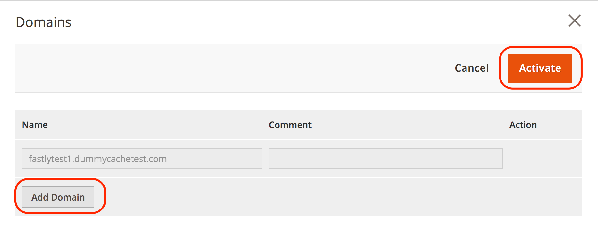

# Personalizar configuración de caché

Después de configurar y probar el servicio de Fastly en los entornos de ensayo y producción, revise y personalice la configuración de la caché. Por ejemplo, puede actualizar la configuración para permitir que TLS redirija solicitudes HTTP a Fastly, actualizar la configuración de depuración y habilitar la autenticación básica para proteger con contraseña el sitio durante el desarrollo.

Las siguientes secciones proporcionan información general e instrucciones para configurar algunos ajustes de la caché. Encuentre información adicional acerca de las opciones de configuración disponibles en el [Módulo Fastly CDN para la documentación de Magento 2](https://github.com/fastly/fastly-magento2/tree/master/Documentation).

## Forzar TLS

Proporciona rápidamente la opción _Forzar TLS_ para redirigir solicitudes sin cifrar (HTTP) a Fastly. Una vez que su entorno de ensayo o producción se haya aprovisionado con un [certificado SSL/TLS válido](fastly-configuration.md#provision-ssltls-certificates), puede actualizar la configuración de Fastly para su almacén para habilitar la opción Forzar TLS. Consulte la guía Fastly [Force TLS](https://github.com/fastly/fastly-magento2/blob/master/Documentation/Guides/FORCE-TLS.md) en el módulo _Fastly CDN para Magento 2_.

>[!NOTE]
>
>Habilitar la opción Forzar TLS es una práctica recomendada para Adobe Commerce en almacenes de infraestructura en la nube.

## Extender el tiempo de espera rápido

La configuración del servicio Fastly especifica un periodo de tiempo de espera predeterminado de 180 segundos para las solicitudes HTTPS al administrador. Cualquier procesamiento de solicitud que supere el tiempo de espera devuelve un error 503. Como resultado, puede recibir 503 errores en respuesta a solicitudes que requieren un procesamiento prolongado o cuando intenta realizar operaciones por lotes.

Para completar acciones masivas que tomen más de 3 minutos, cambie el _tiempo de espera de ruta de administración_ value_ para evitar errores 503.

>[!NOTE]
>
>Si ha especificado un extremo de ruta de administración personalizada en el campo **Ruta de administración personalizada** en **Tiendas** > **Configuración** > **Avanzada** > **Administración** > **URL de base de administración**, también deberá establecer la [variable ADMIN_URL](../environment/variables-admin.md#change-the-admin-url) en ese entorno con el mismo valor. Si la configuración es diferente, el tiempo de espera no funcionará.
>
>Para ampliar los parámetros de tiempo de espera de Fastly para otros usuarios que no sean administradores en la IU de Fastly, consulte [Aumentar los tiempos de espera para trabajos largos](https://github.com/fastly/fastly-magento2/blob/master/Documentation/Guides/Edge-Modules/EDGE-MODULE-INCREASE-TIMEOUTS-LONG-JOBS.md).

**Para ampliar el tiempo de espera de Fastly para el administrador**:

{{admin-login-step}}

1. Haga clic en **Tiendas** > Configuración > **Configuración** > **Avanzado** > **Sistema** y expanda **Caché de página completa**.

1. En la sección _Configuración rápida_, expanda **Configuración avanzada**.

1. Establezca el valor de **tiempo de espera de ruta de administración** en segundos. Este valor no puede ser superior a 10 minutos (600 segundos).

>[!NOTE]
>
>La configuración **_tiempo de espera de ruta de administración_** no controla los valores de tiempo de espera fuera de Adobe Commerce, como el tiempo de espera de Fastly WAF. Para ajustar el valor de tiempo de espera de Fastly WAF, debe abrir un ticket de asistencia de Adobe para actualizarlo en el servicio de Fastly.

1. Haga clic en **Guardar configuración** en la parte superior de la página.

1. Después de que la página se vuelva a cargar, selecciona **Cargar VCL a Fastly** en la sección _Configuración de Fastly_.

Recupera rápidamente la ruta de acceso de administración para generar el archivo VCL desde el archivo de configuración `app/etc/env.php`.

## Configuración de opciones de depuración

Proporciona rápidamente varios tipos de opciones de depuración en la página Administración de caché de Magento, incluidas las opciones para purgar la categoría del producto, los recursos del producto y el contenido. Cuando está habilitado, Fastly observa los eventos para purgar automáticamente esas cachés. Si desactiva una opción de depuración, puede depurar manualmente las cachés de Fastly después de finalizar las actualizaciones a través de la página Gestión de Cachés.

Las opciones de depuración incluyen:

- **Purgar categoría**: purga el contenido de la categoría de producto (no el contenido del producto) cuando agrega y actualiza un solo producto. Es posible que desee mantener esto deshabilitado y habilitar la depuración de productos, que purga productos y categorías de productos.
- **Purgar producto**: purga todo el contenido de productos y categorías de productos al guardar una sola modificación en un producto. Habilitar el producto de purga puede resultar útil para obtener actualizaciones inmediatamente para los clientes al cambiar un precio, agregar una opción de producto y cuando el inventario de productos esté agotado.
- **Purgar página de CMS**: purga el contenido de la página al actualizar y agregar páginas al CMS de Adobe Commerce. Por ejemplo, es posible que desee depurar al actualizar los Términos y condiciones o la política de devoluciones. Si no suele realizar estos cambios, puede deshabilitar la depuración automática.
- **Depuración suave**: establece que el contenido ha cambiado a obsoleto y lo purga según el tiempo de obsolescencia. Además de los horarios de obsolescencia, los clientes reciben contenido obsoleto mientras que Fastly actualiza el contenido en segundo plano.

**Para configurar las opciones de purga de Fastly**:

1. En la sección _Configuración rápida_, expanda **Configuración avanzada** para mostrar las opciones de depuración.

1. Para cada opción de depuración, seleccione **Sí** para habilitar la depuración automática o **No** para deshabilitarla.

   Cuando deshabilita una opción de depuración, debe purgar manualmente la caché de esa categoría desde la página _Administración de caché_.

1. Haga clic en **Guardar configuración** en la parte superior de la página.

1. Después de que la página se vuelva a cargar, selecciona **Cargar VCL a Fastly** en la sección _Configuración de Fastly_.

Para obtener más información, vea [las opciones de configuración de Fastly](https://github.com/fastly/fastly-magento2/blob/21b61c8189971275589219d418332798efc7db41/Documentation/CONFIGURATION.md#further-configuration-options).

## Configuración de la gestión GeoIP

El módulo Fastly incluye la administración de GeoIP para redirigir automáticamente a los visitantes o proporcionar una lista de tiendas que coincidan con el código de país obtenido. Si ya utiliza una extensión para administrar GeoIP, es posible que tenga que verificar las funciones con las opciones de Fastly.

**Para configurar la administración de GeoIp**:

{{admin-login-step}}

1. Haga clic en **Tiendas** > Configuración > **Configuración** > **Avanzado** > **Sistema** y expanda **Caché de página completa**.

1. En la sección _Configuración rápida_, expanda **Configuración avanzada**.

1. Desplácese hacia abajo y seleccione **Yes** para **Habilitar GeoIP**. Se muestran las opciones de configuración adicionales.

1. Para la acción GeoIP, selecciona si el visitante es redirigido automáticamente con **Redirigir** o si se proporciona una lista de tiendas para seleccionar con **Dialog**.

1. Para la asignación de país **Country Mapping**, selecciona **Add** para introducir un código de país de dos letras para asignar con un almacén de Adobe Commerce específico de una lista.

   

1. Haga clic en **Guardar configuración** en la parte superior de la página.

1. Después de volver a cargar la página, seleccione **Cargar VCL a Fastly** en la sección _Configuración de Fastly_.

>[!NOTE]
>
>La implementación actual del módulo Adobe Commerce Fastly GeoIP no admite redirecciones entre varios sitios web.

Fastly también proporciona una serie de [características de VCL relacionadas con la geolocalización](https://developer.fastly.com/reference/vcl/variables/geolocation/) para la codificación de geolocalización personalizada.

## Habilitar los módulos de Fastly Edge

Fastly Edge Modules es una estructura flexible que permite definir componentes de interfaz de usuario y código VCL asociado a través de una plantilla. Estos módulos facilitan la personalización y ampliación de la configuración del servicio Fastly a través de la interfaz de usuario en lugar de utilizar fragmentos de VCL personalizados.

Los módulos de Edge le permiten habilitar funcionalidades específicas como encabezados CORS, reescrituras de mapas de sitios en la nube y configurar la integración entre su tienda de Adobe Commerce y otros CMS o back-end.

Para acceder al menú de Módulos Edge y ver, configurar y administrar los módulos disponibles, active la opción _Habilitar módulos Fastly Edge_. Consulte [Módulos Fastly Edge](https://github.com/fastly/fastly-magento2/blob/master/Documentation/Guides/Edge-Modules/EDGE-MODULES.md) en la documentación del módulo Fastly CDN.

## Configuración de back-ends y blindaje de origen

La configuración del back-end ofrece un ajuste preciso para un rendimiento rápido con blindaje de origen y tiempos de espera. Un _back-end_ es una ubicación específica (IP o dominio) con la configuración del escudo de origen y el tiempo de espera para comprobar y proporcionar contenido almacenado en caché.

_Blindaje de origen_ enruta todas las solicitudes de tu tienda a un punto de presencia (POP) específico. Cuando se recibe una solicitud, el POP comprueba el contenido almacenado en caché y lo proporciona. Si no se almacena en caché, continúa a la POP de escudo y, a continuación, al servidor de origen que almacena en caché el contenido. Los escudos reducen el tráfico directamente al origen.

El código VCL predeterminado de Fastly especifica los valores predeterminados para el blindaje de origen y los tiempos de espera para su Adobe Commerce en sitios de infraestructura en la nube. En algunos casos, es posible que tenga que modificar los valores predeterminados. Por ejemplo, si está obteniendo errores de Tiempo hasta el primer byte (TTFB), es posible que tenga que ajustar el valor de _tiempo de espera del primer byte_.

>[!NOTE]
>
>Si el sitio requiere una integración funcional del servidor como [Wordpress](fastly-vcl-wordpress.md), personalice la configuración del servicio Fastly para agregar el servidor y administrar las redirecciones de la tienda Adobe Commerce a Wordpress. Para obtener más información, consulte [Módulos Fastly de Edge: otra integración de CMS/servidor](https://github.com/fastly/fastly-magento2/blob/master/Documentation/Guides/Edge-Modules/EDGE-MODULE-OTHER-CMS-INTEGRATION.md) en la documentación del módulo Fastly.

**Para revisar la configuración del servidor**:

{{admin-login-step}}

1. Haga clic en **Tiendas** > Configuración > **Configuración** > **Avanzado** > **Sistema** y expanda **Caché de página completa**.

1. Expanda la sección **Configuración rápida**.

1. Expanda **Configuración del servidor** y seleccione el engranaje para comprobar el servidor predeterminado. Se abre un modal que muestra la configuración actual con opciones para cambiarla.

   

1. Seleccione la ubicación **Shield** (o centro de datos).

   La configuración predeterminada de Fastly para el proyecto establece la ubicación más cercana a la región de Cloud Service. Si necesita cambiarla, seleccione una ubicación cerca de la ubicación predeterminada.

1. Modifique los valores de tiempo de espera (en microsegundos) para la conexión al escudo, el tiempo entre bytes y el tiempo para el primer byte. Se recomienda mantener la configuración de tiempo de espera predeterminada.

1. De manera opcional, seleccione **Activar el backend y el escudo después de editar o guardar**.

1. Haga clic en **Cargar** para guardar los cambios y cargarlos en los servidores de Fastly.

1. En el Administrador, seleccione **Guardar configuración**.

Para obtener más información, consulte la [Guía de configuración del servidor](https://github.com/fastly/fastly-magento2/blob/21b61c8189971275589219d418332798efc7db41/Documentation/Guides/BACKEND-SETTINGS.md) en la documentación del módulo de Fastly.

## Autenticación básica

La autenticación básica es una función que protege todas las páginas y recursos del sitio con un nombre de usuario y una contraseña.

Adobe **no recomienda** la activación de la autenticación básica en su entorno de producción. Puede configurarlo en Ensayo para proteger el sitio durante el proceso de desarrollo. Consulte la [Guía de autenticación básica](https://github.com/fastly/fastly-magento2/blob/master/Documentation/Guides/BASIC-AUTH.md) en la documentación del módulo Fastly CDN.

Si agrega acceso de usuario y habilita la autenticación básica en Ensayo, aún puede acceder al administrador sin requerir credenciales adicionales.

>[!NOTE]
>
>**no** debe comprobar [!UICONTROL Enable HTTP access control] en la consola de Cloud para cualquier entorno en el que esté habilitado Fastly (como entornos de ensayo o de producción que no estén activos). Si el control de acceso se configura de esta manera, es posible que los usuarios que anteriormente tenían acceso puedan acceder al sitio si sus credenciales permanecen en la caché de Fastly, incluso después de que se haya rescindido su acceso.

## Creación de fragmentos de VCL personalizados

Fastly admite una versión personalizada del lenguaje de configuración de barniz (VCL) para personalizar la configuración del servicio Fastly. Por ejemplo, puede permitir, bloquear o redirigir el acceso para usuarios específicos o direcciones IP mediante bloques de código VCL con diccionarios Edge y Access Control List (ACL).

Para obtener instrucciones para crear fragmentos de VCL personalizados, diccionarios de Edge y ACL, consulte [fragmentos de VCL personalizados de Fastly](fastly-vcl-custom-snippets.md).

>[!NOTE]
>
>Antes de agregar código VCL, diccionarios perimetrales y ACL personalizados a la configuración del módulo Fastly, compruebe que el servicio de almacenamiento en caché de Fastly funciona con la configuración predeterminada. Ver [Configuración rápida](fastly-configuration.md).

## Administrar dominios

Tanto para los proyectos Starter como Pro, puede usar la opción [!UICONTROL Domains] para agregar y administrar la configuración de dominio de Fastly para su tienda.

- Para proyectos iniciales, vaya a la dirección URL del proyecto en la ficha [!UICONTROL Domains] de [!DNL Cloud Console] para agregar la dirección URL del proyecto.

- Para proyectos Pro, envía un [ticket de soporte de Adobe Commerce](https://experienceleague.adobe.com/docs/commerce-knowledge-base/kb/help-center-guide/magento-help-center-user-guide.html#submit-ticket) para agregar el dominio a la configuración de tu proyecto en la nube. El equipo de asistencia también actualiza la configuración de cuenta de Adobe Commerce Fastly para agregar el dominio.

**Para administrar la configuración de dominio de Fastly desde el administrador**:

{{admin-login-step}}

1. Seleccione **Tiendas** > Configuración > **Configuración** > **Avanzado** > **Sistema** y expanda **Caché de página completa**.

1. En la sección Admin _Configuración rápida_, seleccione **Dominios**.

1. Haga clic en **Administrar dominios** para abrir la página Dominios.

1. Añada los nombres de nivel superior y subdominio para las tiendas en el entorno de Cloud.

   Solo puede especificar dominios que ya se hayan agregado a la configuración de infraestructura de Cloud.

   

1. Haga clic en **Activar** para actualizar la configuración del dominio de Fastly.

>[!NOTE]
>
>Si el mismo dominio se ha configurado en una cuenta diferente de Fastly, debe enviar un vale de soporte de Adobe Commerce para solicitar la delegación de dominio antes de agregar el dominio a Adobe Commerce. Ver [Varias cuentas de Facebook y dominios asignados](fastly.md#multiple-fastly-accounts-and-assigned-domains).

## Activar modo de mantenimiento

Utilice la opción _Modo de mantenimiento_ para permitir el acceso administrativo al sitio desde direcciones IP especificadas y devolver una página de error para todas las demás solicitudes.

**Para habilitar el modo de mantenimiento con acceso administrativo**:

1. Abra la sección _Configuración rápida_ en el Administrador.

1. En la sección _Edge ACL_, actualice la lista de control de acceso (ACL) `maint_allow` con las direcciones IP administrativas que pueden acceder a su tienda mientras esté en modo de mantenimiento.

   

1. En la sección _Modo de mantenimiento_, seleccione **Habilitar modo de mantenimiento**.

   Después de habilitar el modo de mantenimiento, se bloqueará todo el tráfico excepto las solicitudes de las direcciones IP de la ACL `maint_allowlist`. Puede actualizar `maint_allowlist` para cambiar las direcciones IP en la ACL.

   Para obtener instrucciones de configuración detalladas, consulte la [guía del modo de mantenimiento](https://github.com/fastly/fastly-magento2/blob/master/Documentation/Guides/MAINTENANCE-MODE.md) en la documentación del módulo Fastly CDN para Magento 2.
