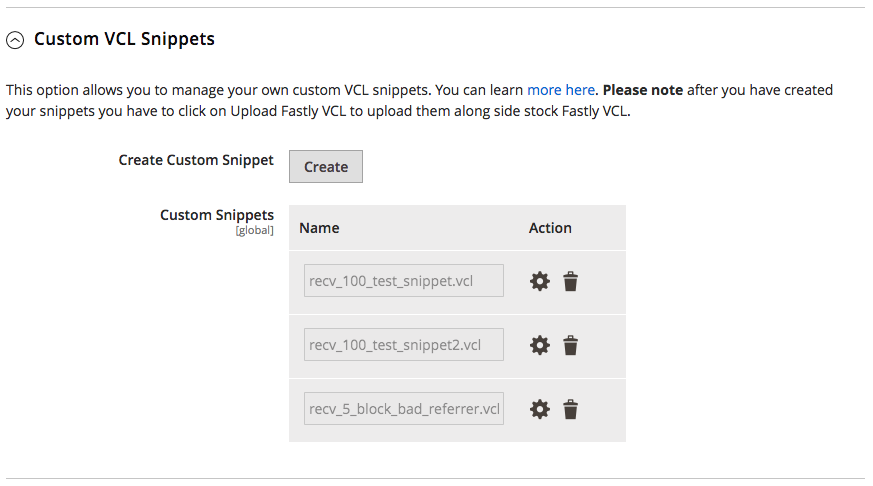

# Introducción a VCL personalizado

Fastly admite una versión personalizada del lenguaje de configuración de barniz (VCL) para adaptar la configuración del servicio Fastly a sus necesidades.

Los fragmentos personalizados de VCL son bloques de lógica VCL que se añaden a la versión activa de VCL cargada en el sitio de Adobe Commerce. Un fragmento de VCL personalizado modifica la velocidad con la que los servicios de almacenamiento en caché responden al tráfico de solicitud. Por ejemplo, puede agregar un fragmento de VCL personalizado para permitir el tráfico de solicitudes solo desde direcciones IP de cliente especificadas. O bien, cree un fragmento para bloquear el tráfico de sitios web conocidos por enviar spam de referencia a sus sitios de Adobe Commerce.

Los fragmentos de VCL personalizados (generados, compilados y transmitidos a todas las cachés de Fastly) se cargan y activan sin tiempo de inactividad del servidor.

>[!NOTE]
>
>Antes de agregar código VCL, diccionarios perimetrales y ACL personalizados a la configuración del módulo Fastly, compruebe que el servicio de almacenamiento en caché de Fastly funciona con la configuración predeterminada. Consulte [Configurar servicios de Fastly](fastly-configuration.md).

Rápidamente admite dos tipos de fragmentos de VCL personalizados:

- [Fragmentos regulares](https://docs.fastly.com/en/guides/about-vcl-snippets): los fragmentos personalizados de VCL regulares están codificados para versiones específicas de VCL. Puede crear, modificar e implementar fragmentos de VCL normales desde el Administrador o la API de Fastly.

- [Fragmentos dinámicos](https://docs.fastly.com/en/guides/using-dynamic-vcl-snippets): fragmentos de VCL creados con la API de Fastly. Puede modificar e implementar fragmentos dinámicos sin tener que actualizar la versión de VCL de Fastly para el servicio.

Se recomienda utilizar fragmentos de VCL personalizados con diccionarios de Edge y listas de control de acceso (ACL) para almacenar los datos utilizados en el código personalizado.

- [**Diccionario Edge**](https://docs.fastly.com/guides/edge-dictionaries/about-edge-dictionaries): almacena los datos como pares clave-valor en un contenedor de diccionario al que se puede hacer referencia desde fragmentos de VCL personalizados

- [**Edge ACL**](https://docs.fastly.com/guides/access-control-lists/about-acls): almacena los datos de la dirección IP del cliente que define la lista de control de acceso para las reglas de bloqueo o de permiso implementadas mediante fragmentos de VCL personalizados

Los datos de diccionario y ACL se implementan en los nodos de Fastly Edge accesibles en las regiones de red. Además, los datos se pueden actualizar dinámicamente en toda la red sin que sea necesario volver a implementar el código VCL para el entorno de ensayo o producción.

>[!NOTE]
>
>Solo puede agregar fragmentos de VCL personalizados a un entorno de ensayo o producción si ha [configurado Fastly services](fastly-configuration.md) para ese entorno.

## Tutorial

Este tutorial y ejemplos muestran el uso de fragmentos de VCL personalizados normales con diccionarios de Edge y ACL de Edge para personalizar la configuración del servicio de Fastly para Adobe Commerce. Para obtener información más detallada, consulte la documentación de Fastly:

- [Guía de Fastly VCL](https://docs.fastly.com/guides/vcl/guide-to-vcl): Información sobre la implementación de Fastly Varnish, las extensiones de Fastly VCL y recursos para obtener más información acerca de Varnish y VCL.
- [Referencia de VCL de Fastly](https://docs.fastly.com/guides/vcl/): referencia de programación detallada para desarrollar y solucionar problemas de fragmentos de VCL y VCL personalizados de Fastly.

Puede crear y administrar fragmentos de VCL personalizados desde el administrador de Adobe Commerce o mediante la API de Fastly:

- [Administrador de Adobe Commerce](#manage-custom-vcl-from-admin): Se recomienda usar el administrador de Adobe Commerce para administrar fragmentos de VCL personalizados, ya que automatiza el proceso de validar, cargar y aplicar los cambios de VCL a la configuración del servicio de Fastly. Además, puede ver y editar los fragmentos de VCL personalizados añadidos a la configuración del servicio de Fastly desde el administrador.

- [API de Fastly](#manage-vcl-using-the-api): si no puede acceder al administrador, utilice la API de Fastly para administrar fragmentos de VCL personalizados. Por ejemplo, utilice la API para solucionar los problemas de la configuración del servicio de Fastly cuando el sitio esté caído o para añadir un fragmento de VCL personalizado. Además, algunas operaciones solo se pueden completar usando la API. Por ejemplo, debe utilizar la API para reactivar una versión de VCL anterior o para ver todos los fragmentos de VCL incluidos en una versión de VCL especificada. Consulte [Referencia rápida de la API para fragmentos de VCL](#api-quick-reference-for-vcl-snippets).

### Ejemplo de código de fragmento VCL

El siguiente ejemplo muestra el fragmento de VCL personalizado (formato JSON) que filtra el tráfico por dirección IP del cliente:

```json
{
  "service_id": "FASTLY_SERVICE_ID",
  "version": "{Editable Version #}",
  "name": "apply_acl",
  "priority": "100",
  "dynamic": "1",
  "type": "hit",
  "content": "if ((client.ip ~ {ACLNAME}) && !req.http.Fastly-FF){ error 403; }"
}
```

>[!WARNING]
>
>En este ejemplo, el código VCL tiene el formato de carga útil JSON que se puede guardar en un archivo y enviar en una solicitud de API de Fastly. Para evitar errores de validación de JSON al enviar el fragmento como JSON para una solicitud de API, utilice una barra invertida para escapar de los caracteres especiales del código. Consulte [Uso de fragmentos de VCL dinámicos](https://docs.fastly.com/vcl/vcl-snippets/) en la documentación de VCL de Fastly. Si envía el fragmento de VCL desde el administrador, no tiene que omitir los caracteres especiales.

La lógica VCL del campo `content` realiza las siguientes acciones:

- Comprueba la dirección IP entrante, `client.ip` en cada solicitud

- Bloquea cualquier solicitud con una dirección IP incluida en la ACL perimetral *ACLNAME*, devolviendo un error `403 Forbidden`

La siguiente tabla proporciona detalles sobre los datos clave para los fragmentos de VCL personalizados. Para obtener una referencia más detallada, consulte la referencia de [fragmentos de VCL](https://docs.fastly.com/api/config#api-section-snippet) en la documentación de Fastly.

| Valor | Descripción |
|--------------|-------------------------------------------------------------------------------------------------------------------------------------------------------------------------------------------------------------------------------------------------------------------------------------------------------------------------------------------------------------------------------------------------------------------------------------------------------------------------------------------------------------------------------------------------------------------------------------------------------------------------------------------------------------------------------------------------------------------------|
| `API_KEY` | La clave API para acceder a su cuenta de Facebook. Ver [Obtener credenciales](fastly-configuration.md). |
| `active` | Estado activo del fragmento o la versión. Devuelve `true` o `false`. Si el valor es True, el fragmento o la versión están en uso. Clone un fragmento activo mediante su número de versión. |
| `content` | El fragmento de código VCL que se va a ejecutar. Fastly no admite todas las funciones de lenguaje VCL. Además, proporciona a las extensiones de Fastly funcionalidad personalizada. Para obtener más información acerca de las características compatibles, consulte la [Referencia de programación de VCL de Fastly](https://docs.fastly.com/vcl/reference/). |
| `dynamic` | Estado dinámico de un fragmento de código. Devuelve `false` para [fragmentos regulares](https://docs.fastly.com/en/guides/about-vcl-snippets) incluidos en la VCL con versiones para la configuración del servicio de Fastly. Devuelve `true` para un [fragmento dinámico](https://docs.fastly.com/vcl/vcl-snippets/using-dynamic-vcl-snippets/) que se puede modificar e implementar sin requerir una nueva versión de VCL. |
| `number` | Número de versión de VCL donde se incluye el fragmento. Fastly usa *Versión editable #* en sus valores de ejemplo. Si agrega fragmentos personalizados desde la API, incluya el número de versión en la solicitud de API. Si agrega una VCL personalizada desde el Administrador, se proporciona la versión para usted. |
| `priority` | Valor numérico de `1` a `100` que especifica cuándo se ejecuta el código de fragmento de VCL personalizado. Los fragmentos con valores de prioridad más bajos se ejecutan primero. Si no se especifica, el valor predeterminado de `priority` es `100`.<p>Cualquier fragmento de VCL personalizado con un valor de prioridad de `5` se ejecuta inmediatamente, lo que es mejor para el código de VCL que implementa el enrutamiento de solicitudes (bloqueo y listas de permitidos y redirecciones). La prioridad `100` es mejor para anular el código de fragmento de VCL predeterminado.<p>Todos los [fragmentos de VCL predeterminados](fastly-configuration.md#upload-vcl-snippets) incluidos en el módulo Magento-Fastly tienen `priority=50`.<ul><li>Asigne una prioridad alta como `100` para ejecutar el código VCL personalizado después de todas las demás funciones VCL y anule el código VCL predeterminado.</li></ul> |
| `service_id` | El ID de servicio rápido de un entorno de ensayo o producción específico. Este identificador se asigna cuando su proyecto se agrega a Adobe Commerce en la infraestructura en la nube [Cuenta de servicio rápido](fastly.md#fastly-service-account-and-credentials). |
| `type` | Especifica la ubicación para insertar el fragmento generado, como `init` (por encima de las subrutinas) y `recv` (dentro de las subrutinas). Para obtener más información, consulte la referencia de [fragmentos de VCL](https://docs.fastly.com/api/config#api-section-snippet) de Fastly. |

## Administrar VCL personalizada desde el administrador

Puede [agregar fragmentos de VCL personalizados](https://github.com/fastly/fastly-magento2/blob/master/Documentation/Guides/CUSTOM-VCL-SNIPPETS.md) desde la sección *Configuración rápida* > *Fragmentos de VCL personalizados* en el administrador.



La vista *Fragmentos de VCL personalizados* solo muestra los fragmentos que se han agregado a través del administrador. Si se agregan fragmentos de código mediante la API de Fastly, use la API para [administrarlos](#manage-vcl-using-the-api).

Los siguientes ejemplos muestran cómo crear y administrar fragmentos de VCL personalizados desde Admin y cómo utilizar los módulos de Fastly Edge y los diccionarios de Edge:

- [Redireccionar solicitudes a un servidor de CMS](fastly-vcl-wordpress.md)
- [Bloquear spam de referencia](fastly-vcl-badreferer.md)
- [Bloquear spam de referencia](fastly-vcl-badreferer.md)
- [VCL personalizado para lista de permitidos IP](fastly-vcl-allowlist.md)
- [VCL personalizado para lista de bloqueados IP](fastly-vcl-blocking.md)
- [Omitir caché de Fastly](fastly-vcl-bypass-to-origin.md)

## Fragmentos de código que no se pueden ver ni modificar en el administrador de Commerce

No puede ver ni modificar algunos fragmentos directamente desde el administrador de Commerce. Por ejemplo, [fragmentos dinámicos](https://docs.fastly.com/en/guides/using-dynamic-vcl-snippets). En la sección Fragmentos de VCL personalizados, no verá los fragmentos agregados por el equipo de soporte en la nube directamente al [panel de administración de Fastly](fastly.md#fastly-service-account-and-credentials).


**Para observar los fragmentos agregados por el equipo de soporte en la nube:**

1. Vaya a la sección **Herramientas**.

1. Haga clic en **Enumerar todas las versiones** junto a _Historial de versiones_.

1. Haga clic en el icono en forma de ojo situado junto a la versión de VCL aplicable para ver los fragmentos existentes.


## Administración de VCL mediante la API

El siguiente tutorial muestra cómo crear archivos de fragmento de VCL normales y añadirlos a la configuración del servicio de Fastly mediante la API de Fastly. Puede crear y administrar los fragmentos de código desde la aplicación *terminal*. No necesita una conexión SSH a un entorno específico.

**Requisitos previos:**

- Configure su Adobe Commerce en el entorno de la infraestructura de la nube para los servicios de Fastly. Ver [Configuración rápida](fastly-configuration.md).

- [Obtenga credenciales de la API de Fastly](fastly-configuration.md) para autenticar solicitudes en la API de Fastly. Asegúrese de obtener las credenciales para el entorno correcto: Ensayo o Producción.

- Guarde las credenciales del servicio de Fastly como variables de entorno de bash que puede utilizar en comandos cURL:

  ```bash
  export FASTLY_SERVICE_ID=<Service-ID>
  ```

  ```bash
  export FASTLY_API_TOKEN=<API-Token>
  ```

  Las variables de entorno exportadas solo están disponibles en la sesión actual de bash y se pierden al cerrar el terminal. Puede redefinir las variables exportando un nuevo valor. Para ver la lista de variables exportadas relacionadas con Fastly:

  ```bash
  export | grep FASTLY
  ```

## Añadir fragmentos de VCL

Este tutorial proporciona los pasos básicos para agregar fragmentos personalizados mediante la API de Fastly.

>[!NOTE]
>
>Para obtener información sobre cómo administrar fragmentos de VCL personalizados desde Adobe Commerce Admin, consulte [Administrar VCL desde Adobe Commerce Admin](#manage-custom-vcl-from-admin).


**Requisitos previos**

{{$include /help/_includes/vcl-snippet-prerequisites.md}}

### Paso 1: Localizar la versión activa de VCL

Utilice la operación [obtener versión](https://docs.fastly.com/api/config#version_dfde9093f4eb0aa2497bbfd1d9415987) de la API de Fastly para obtener el número de versión de VCL activo:

```bash
curl -H "Fastly-Key: $FASTLY_API_TOKEN" https://api.fastly.com/service/$FASTLY_SERVICE_ID/version/active
```

En la respuesta JSON, anote el número de versión de VCL activo devuelto en la clave `number`, por ejemplo `"number": 99`. Necesita el número de versión al clonar el VCL para editarlo.

```json
{
  "testing": false,
  "locked": true,
  "number": 99,
  "active": true,
  "service_id": "872zhjyxhto5SIRb3GAE0",
  "staging": false,
  "created_at": "2019-01-29T22:38:53Z",
  "deleted_at": null,
  "comment": "Magento Module uploaded VCL",
  "updated_at": "2019-01-29T22:39:06Z",
  "deployed": false
}
```

Guarde el número de versión activo en una variable de entorno bash para utilizarlo en solicitudes de API posteriores:

```bash
export FASTLY_VERSION_ACTIVE=<Version>
```

### Paso 2: clonar la versión activa de VCL y todos los fragmentos

Para poder añadir o modificar fragmentos de VCL personalizados, debe crear una copia de la versión de VCL activa para editarla. Use la operación [clone](https://docs.fastly.com/api/config#version_7f4937d0663a27fbb765820d4c76c709) de la API de Fastly:

```bash
curl -H "Fastly-Key: $FASTLY_API_TOKEN" https://api.fastly.com/service/$FASTLY_SERVICE_ID/version/$FASTLY_VERSION_ACTIVE/clone -X PUT
```

En la respuesta JSON, el número de versión se incrementa y el valor de la clave *active* es `false`. Puede modificar la nueva versión de VCL inactiva localmente.

```json
{
  "testing": false,
  "locked": false,
  "number": 100,
  "active": false,
  "service_id": "vW2bLFWhhto5SIRb3GAE0",
  "staging": false,
  "created_at": "2019-01-29T22:38:53Z",
  "deleted_at": null,
  "comment": "Magento Module uploaded VCL",
  "updated_at": "2019-01-29T22:39:06Z",
  "deployed": false
}
```

Guarde el nuevo número de versión en una variable de entorno bash para utilizarlo en comandos posteriores:

```bash
export FASTLY_EDIT_VERSION=<Version>
```

### Paso 3: Crear un fragmento de VCL personalizado

Cree y guarde su código VCL personalizado en un archivo JSON con el siguiente contenido y formato:

```json
{
  "name": "<name>",
  "dynamic": "0",
  "type": "<type>",
  "priority": "100",
  "content": "<code all in one line>"
}
```

Los valores incluyen:

- `name`: nombre del fragmento de VCL.

- `dynamic`: indica si se trata de un [fragmento normal](https://docs.fastly.com/en/guides/about-vcl-snippets) o de un [fragmento dinámico](https://docs.fastly.com/guides/vcl-snippets/using-dynamic-vcl-snippets).

- `type`: especifica la ubicación para insertar el fragmento generado, como `init` (sobre subrutinas) y `recv` (dentro de subrutinas). Consulte [Valores de objeto de fragmento de VCL de Fastly](https://docs.fastly.com/api/config#snippet) para obtener información sobre estos valores.

- `priority`: un valor de `1` a `100` que determina cuándo se ejecuta el código de fragmento de VCL personalizado. Los fragmentos de VCL personalizados con valores más bajos se ejecutan primero.

  Todo el código VCL predeterminado del módulo Fastly VCL tiene un `priority` de `50`. Si desea que una acción se produzca en último lugar o que se anule el código VCL predeterminado, utilice un número mayor, como `100`. Para ejecutar el código de fragmento de VCL personalizado inmediatamente, establezca la prioridad en un valor inferior, como `5`.

- `content`: fragmento de código VCL que se ejecutará en una línea, sin saltos de línea. Consulte [Ejemplo de fragmento de VCL personalizado](#example-vcl-snippet-code).

### Paso 4: Añadir un fragmento de VCL a la configuración de Fastly

Utilice la operación de API de Fastly [create snippet](https://docs.fastly.com/api/config#snippet_41e0e11c662d4d56adada215e707f30d) para agregar el fragmento de VCL personalizado a la versión de VCL.

```bash
curl -H "Fastly-Key: $FASTLY_API_TOKEN" https://api.fastly.com/service/$FASTLY_SERVICE_ID/version/$FASTLY_EDIT_VERSION/snippet -H 'Content-Type: application/json' -X POST --data @<filename.json>
```

`<filename.json>` es el nombre del archivo que preparó en el paso anterior. Repita este comando para cada fragmento de VCL.

Si recibe una respuesta de `500 Internal Server Error` del servicio Fastly, compruebe la sintaxis del archivo JSON para asegurarse de que está cargando un archivo válido.

### Paso 5: Validar y activar fragmentos de VCL personalizados

Después de agregar un fragmento de VCL personalizado, inserta rápidamente el fragmento en la versión de VCL que está editando. Para aplicar cambios, complete los siguientes pasos para validar el código del fragmento de VCL y activar la versión de VCL.

1. Utilice la operación Fastly API [validate VCL version](https://docs.fastly.com/api/config#version_97f8cf7bfd5dc2e5ea1933d94dc5a9a6) para comprobar el código VCL actualizado.

   ```bash
   curl -H "Fastly-Key: $FASTLY_API_TOKEN" https://api.fastly.com/service/$FASTLY_SERVICE_ID/version/$FASTLY_EDIT_VERSION/validate
   ```

   Si la API de Fastly devuelve un error, corrija el problema y valide de nuevo la versión actualizada de VCL.

1. Use la operación [activar](https://docs.fastly.com/api/config#version_0b79ae1ba6aee61d64cc4d43fed1e0d5) de la API de Fastly para activar la nueva versión de VCL.

   ```bash
   curl -H "Fastly-Key: $FASTLY_API_TOKEN" https://api.fastly.com/service/$FASTLY_SERVICE_ID/version/$FASTLY_EDIT_VERSION/activate -X PUT
   ```


## Referencia rápida de API para fragmentos de VCL

Estos ejemplos de solicitud de API utilizan variables de entorno exportadas para proporcionar las credenciales y autenticarse con Fastly. Para obtener más información sobre estos comandos, consulte [Referencia de la API de Fastly](https://docs.fastly.com/api/config#vcl).

>[!NOTE]
>
>Utilice estos comandos para administrar los fragmentos que ha agregado mediante la API de Fastly. Si agregó fragmentos desde el administrador, consulte [Administrar fragmentos de VCL con el administrador](#manage-vcl-using-the-api).

- **Obtener número de versión de VCL activa**

  ```bash
  curl -H "Fastly-Key: $FASTLY_API_TOKEN" https://api.fastly.com/service/$FASTLY_SERVICE_ID/version/active
  ```

- **Enumerar todos los fragmentos de VCL normales adjuntos a un servicio**

  ```bash
  curl -H "Fastly-Key: $FASTLY_API_TOKEN" https://api.fastly.com/service/$FASTLY_SERVICE_ID/version/$FASTLY_VERSION/snippet
  ```

- **Revisar un fragmento individual**

  ```bash
  curl -H "Fastly-Key: $FASTLY_API_TOKEN" https://api.fastly.com/service/$FASTLY_SERVICE_ID/version/$FASTLY_VERSION/snippet/<snippet_name>
  ```

  `<snippet_name>` es el nombre de un fragmento, como `my_regular_snippet`.

- **Actualizar un fragmento**

  Modifique el [archivo JSON preparado](#step-3-create-a-custom-vcl-snippet) y envíe la siguiente solicitud:

  ```bash
  curl -H "Fastly-Key: $FASTLY_API_TOKEN" https://api.fastly.com/service/$FASTLY_SERVICE_ID/version/$FASTLY_VERSION/snippet/<snippet_name> -H 'Content-Type: application/json' -X PUT --data @<filename.json>
  ```

- **Eliminar un fragmento de VCL individual**

  Obtenga una lista de fragmentos de código y utilice el siguiente comando `curl` con el nombre de fragmento específico que desea eliminar:

  ```bash
  curl -H "Fastly-Key: $FASTLY_API_TOKEN" https://api.fastly.com/service/$FASTLY_SERVICE_ID/version/$FASTLY_VERSION/snippet/<snippet_name> -X DELETE
  ```

- **Anular valores en el [código predeterminado de Fastly VCL](https://github.com/fastly/fastly-magento2/tree/master/etc/vcl_snippets)**

  Cree un fragmento con valores actualizados y asigne una prioridad de `100`.
