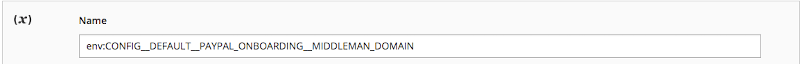

# Variables específicas de la nube

Las variables de entorno específicas de Adobe Commerce en la infraestructura de la nube utilizan el prefijo `MAGENTO_CLOUD_*`:

| Variable | Descripción |
| -------- | --------------- |
| `MAGENTO_CLOUD_APP_DIR` | Ruta absoluta al directorio de la aplicación. |
| `MAGENTO_CLOUD_APPLICATION` | Objeto JSON con codificación base64 que describe la aplicación. Se asigna al contenido del archivo `.magento.app.yaml` y tiene subclaves. |
| `MAGENTO_CLOUD_APPLICATION_NAME` | Nombre de la aplicación configurada en el archivo `.magento.app.yaml`. |
| `MAGENTO_CLOUD_DOCUMENT_ROOT` | La ruta absoluta a la raíz del documento web, si corresponde. |
| `MAGENTO_CLOUD_ENVIRONMENT` | Nombre de la rama de entorno. |
| `MAGENTO_CLOUD_PROJECT` | El ID del proyecto. |
| `MAGENTO_CLOUD_RELATIONSHIPS` | Objeto JSON codificado en Base64 que representa la definición del extremo de clave (nombre de relación) y valor (matrices de pares de relaciones). Cada definición de extremo de relación es una forma descompuesta de una dirección URL. Tiene `scheme`, `host`, `port` y _opcionalmente_, `username`, `password`, `path`, así como información adicional en `query`. |
| `MAGENTO_CLOUD_ROUTES` | Describa las rutas definidas en el archivo de entorno `.magento/routes.yaml`. |
| `MAGENTO_CLOUD_TREE_ID` | El ID de árbol para la aplicación, que corresponde al SHA del árbol en Git. |
| `MAGENTO_CLOUD_VARIABLES` | Un objeto JSON con codificación base64 con pares clave-valor, como `"key":"value"`. |
| `MAGENTO_CLOUD_LOCKS_DIR` | Proporciona la ruta al punto de montaje para el proveedor de bloqueos en la infraestructura de la nube. El proveedor de bloqueo evita el inicio de trabajos cron y grupos cron duplicados. |

>[!WARNING]
>
>Para agregar variables de entorno a [omitir configuración](https://experienceleague.adobe.com/docs/commerce-operations/configuration-guide/paths/override-config-settings.html) usando [[!DNL Cloud Console]](../project/overview.md), debe anteponer el nombre de la variable con `env:`, como se muestra en el ejemplo siguiente:
>
>

Dado que los valores pueden cambiar con el tiempo, es mejor inspeccionar la variable durante la ejecución y utilizarla para configurar la aplicación. Por ejemplo, use la variable `MAGENTO_CLOUD_RELATIONSHIPS` para recuperar relaciones relacionadas con el entorno de la siguiente manera:

```php
<?php
/**
  * Get relationships information from cloud environment variable.
  *
  * @return mixed
  */
    protected function getRelationships()
    {
        return json_decode(base64_decode($_ENV["MAGENTO_CLOUD_RELATIONSHIPS"]), true);
    }
```

## Visualización de variables de entorno

Puede usar el comando `env:config:show` de [el paquete `ece-tools`](../dev-tools/package-overview.md) para mostrar una lista de variables para el entorno actual.

```bash
php ./vendor/bin/ece-tools env:config:show variables
```

Salida de ejemplo para la opción `variables`:

```
Magento Cloud Environment Variables:
+-----------------------------------+----------------------------------+
| Variable name                     | Value                            |
+-----------------------------------+----------------------------------+
| ADMIN_EMAIL                       | commerceadmin@company.com        |
| ADMIN_PASSWORD                    | 123123q                          |
+-----------------------------------+----------------------------------+
```
