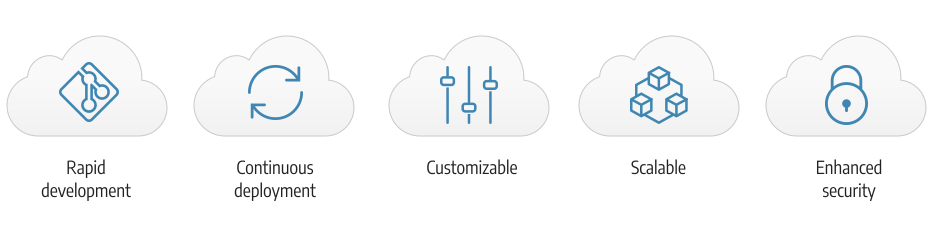

# Commerce en infraestructura en la nube

Adobe Commerce en la nube proporciona una plataforma de alojamiento automatizada con un enfoque de **autoservicio** para crear, implementar y administrar su aplicación [!DNL Commerce] en un entorno nativo de la nube. Adobe Commerce en la infraestructura en la nube incluye funciones adicionales que lo diferencian de las plataformas locales de Adobe Commerce y Magento Open Source:

- Infraestructura aprovisionada previamente que incluye PHP, MySQL (MariaDB), Redis, [!DNL RabbitMQ] y tecnologías de motores de búsqueda compatibles.
- Flujo de trabajo basado en Git con compilación e implementación automáticas para un desarrollo rápido y una implementación continua eficientes cada vez que inserte cambios en el código en un entorno de Platform as a Service (PaaS).
- Los archivos de configuración de entorno altamente personalizables y la interfaz de línea de comandos (CLI) administran e implementan herramientas.
- Alojamiento de Amazon Web Service (AWS) que ofrece un entorno escalable y seguro para las ventas y la venta minorista en línea.

>[!NOTE]
>
>Para obtener más información sobre seguridad, consulte la [lista de comprobación de inicio de seguridad](https://experienceleague.adobe.com/es/docs/commerce-on-cloud/user-guide/launch/checklist#security-configuration).

Vea en detalle [la pila de tecnología](architecture/tech-stack.md) o aprenda más acerca de características específicas y productos compatibles en la [arquitectura de la nube para Commerce](architecture/cloud-architecture.md).

## Regiones de nube

Las secciones siguientes proporcionan detalles sobre las diferentes regiones de AWS y Azure disponibles para Adobe Commerce en la infraestructura en la nube.

## Regiones de AWS

{zoomable="yes"}

>[!NOTE]
>
> Solo local en China y Rusia.

## Regiones de Azure

{zoomable="yes"}

>[!NOTE]
>
> Solo local en China y Rusia. Todos los comerciantes que requieran entornos de integración deben utilizar regiones de EE. UU.

## Documentación de Adobe Commerce

La guía de Commerce sobre la infraestructura en la nube supone que tiene algunos conocimientos prácticos y comprensión de la aplicación de Adobe Commerce. Puede consultar las guías para desarrolladores y usuarios de [!DNL Commerce] a continuación:

- [Documentación para desarrolladores de Adobe Commerce](https://developer.adobe.com/commerce/docs/) (sitio de Adobe Developer): desarrolle, personalice, integre, amplíe y utilice funciones avanzadas

- [Documentación de Adobe Commerce](https://experienceleague.adobe.com/docs/commerce.html?lang=es) (Adobe Experience League): Planifique, implemente, utilice, actualice y mantenga sus [!DNL Commerce] proyectos

{{$include /help/_includes/templated/whats-new.md}}

<!-- Last updated from includes: 2025-09-19 20:32:03 -->
