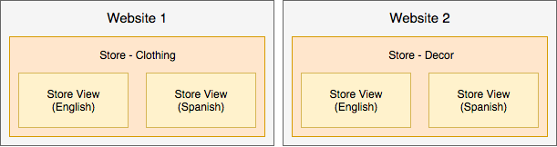

# Prácticas recomendadas para la configuración de tiendas

Para obtener información detallada sobre cómo configurar tu tienda, sitios y sitios web, revisa la [Guía del usuario de Adobe Commerce](https://experienceleague.adobe.com/docs/commerce-admin/user-guides/home.html?lang=es). Esta página proporciona prácticas recomendadas, información útil y directrices para configurar tiendas, sitios y mucho más con contenido adicional que se publicará a lo largo del tiempo y en todas las versiones.

## Campañas y promociones de marketing

Esta información es útil para Adobe Commerce en la infraestructura en la nube 2.1.X y 2.2.X.

Para crear campañas y promociones, crea las opciones y la configuración en [Ensayo de contenido](https://experienceleague.adobe.com/docs/commerce-admin/content-design/staging/content-staging.html?lang=es). Esta función le permite crear y previsualizar sus campañas antes de hacerlas públicas para las ventas de clientes. La siguiente información proporciona información útil. Para obtener instrucciones exactas, consulte el contenido de la Guía del usuario de Adobe Commerce vinculada.

_Campañas_ son eventos de marketing para ventas de temporada, nuevas líneas de productos y mucho más. Cada campaña puede incluir temáticas personalizadas, bloques de contenido, widgets para controlar y mostrar contenido y promociones asociadas con reglas de precios. Debido a la amplia naturaleza de una campaña, las crea con una fecha de inicio y de finalización a través del Ensayo de contenido.

_Promociones_ ofrecen descuentos, ofertas únicas, cupones, incentivos para compradores nuevos y mucho más. Estas promociones se crean como _reglas de precios_ que establecen los términos, descuentos y opciones para animar a los clientes a comprar. Puede crear reglas de precios en el [carro de compras](https://experienceleague.adobe.com/docs/commerce-admin/marketing/promotions/cart-rules/price-rules-cart.html?lang=es) o el [catálogo](https://experienceleague.adobe.com/docs/commerce-admin/marketing/promotions/catalog-rules/price-rules-catalog.html?lang=es), con opciones adicionales para banners, puntos de recompensa y mucho más. Puede programar campañas para sus promociones y aplicar reglas de precios para eventos importantes como una nueva línea de productos o ventas estacionales.

A continuación se ofrecen sugerencias para crear, actualizar y administrar promociones y campañas:

* Una promoción puede formar parte de una campaña. Una campaña no puede formar parte de una promoción. Puede tener listas de promociones como reglas de precio para usarlas varias veces, con varias campañas.
* Al crear una promoción, siempre se crea una campaña inicial inactiva. Tiene una fecha de inicio, pero no una fecha de finalización. Puede ignorar esta campaña inicial. Puede Programar una nueva actualización con la programación de campaña correcta y activarla.
* Una campaña tiene una fecha de inicio y de finalización, no una promoción. El Scheduler que aparece al crear una promoción no configura las fechas de inicio y finalización de la misma. Esto le permite programar una campaña para esta promoción mientras se encuentra en la página de configuración de la promoción.
* No puede editar directamente en Contenido ensayado. Si debe editar la configuración y las opciones en la campaña, edite el original o una réplica y envíelos para sobrescribirlos en el Contenido ensayado. Por ejemplo, si no especifica una fecha de finalización para una campaña, debe editar la original y la push para actualizar.

## Precios avanzados y contenido ensayado

Esta información es útil para Adobe Commerce en la infraestructura en la nube 2.1.X y 2.2.X.

Normalmente, puede establecer [Precios avanzados](https://experienceleague.adobe.com/docs/commerce-admin/catalog/products/pricing/pricing-advanced.html?lang=es) para los productos a través del área de **Productos** > **Catálogos** del administrador. Con Contenido en prueba, complete algunos pasos adicionales para añadir el precio a una promoción y campaña.

Para editar Asignación de Precios Avanzada y actualizar Ensayo de Contenido:

1. Inicie sesión en Admin.
1. Vaya a **Productos** > **Catálogo** y seleccione un producto y edítelo.
1. En la ficha Precios, seleccione **Precios avanzados**. Edite el precio y guarde los cambios.
1. En la parte superior de la página, haz clic en **Programar nueva actualización**.
1. Cree una promoción para el producto.
1. Completa la información de la promoción. En Planificador, introduzca una fecha y una hora de inicio y finalización.
1. Guarde la promoción. Se crea una campaña inicial inactiva.
1. Puede Previsualizar para revisar el precio especial, el nombre de la promoción, el precio normal y el intervalo de fechas programadas para la campaña.

Para ver los pasos adicionales, puede continuar con las instrucciones con [Cambios de horario para las reglas de precios de catálogo](https://experienceleague.adobe.com/docs/commerce-admin/marketing/promotions/catalog-rules/price-rule-catalog-scheduled-changes.html?lang=es). Haga clic en **Siguiente** para recorrer los pasos.

## Reglas de precios

Las reglas de precios pueden incluir lógica y condiciones tan ilimitadas como su imaginación de marketing. Algunos ejemplos populares incluyen Buy One Get One Free, Buy One Get One con un 50% de descuento, un descuento de 25 dólares en pedidos de más de 100 dólares y más.

Para crear una regla de precio, consulte [Guía del usuario de Adobe Commerce](https://experienceleague.adobe.com/docs/commerce-admin/marketing/promotions/catalog-rules/price-rules-catalog-create.html?lang=es).

A continuación se proporciona un ejemplo de creación de una regla de precio para un descuento de sólo primer pedido. Para este descuento, le interesa:

* Crear una regla de precio con un [segmento de cliente](https://experienceleague.adobe.com/es/docs/commerce-admin/customers/segments/customer-segment-price-rule) con una condición: Cantidad total de pedidos inferior a 1
* Añadir este segmento de cliente como condición a la regla de carro de compras
* Opcional: Añada condiciones y reglas para aplicar los descuentos a SKU específicas o categorías de productos para compras específicas

Esto garantiza que los clientes nuevos netos o los clientes existentes que no hayan realizado una compra reciban el descuento solo en su primer pedido. Puede crear titulares y enviar promociones por correo electrónico con el descuento por primera vez en la compra.

## Vistas de tienda

Puede configurar y ejecutar varias tiendas con una sola implementación de Adobe Commerce en la infraestructura en la nube. Ver [Configurar varios sitios web o tiendas](multiple-sites.md).

En las tiendas que no interactúen, puede crear varios _sitios web_. Cada sitio web tiene artículos específicos, datos de clientes, cierres de compra y carros de compras que no se comparten con otros sitios web en Adobe Commerce.

Cada sitio web puede incluir una o más _tiendas_ con diferentes categorías y artículos, datos de clientes compartidos, cierre de compra y carro de compras. Para estas tiendas, un cliente puede registrarse una vez y comprar en diferentes catálogos de productos con un solo pago.

Además, puede crear _vistas de tiendas_ para diferentes idiomas, diseños y diseños. Cada vista puede tener un dominio, una marca y un idioma independientes al compartir artículos, datos de clientes, cierres de compra y el carro de compras.

Los siguientes son ejemplos para explicarlos mejor:

* Sitio web único con una tienda y dos vistas para la configuración regional en inglés y español. Se comparten todos los datos del artículo, los clientes, el cierre de compra y el carro de compras.

  

* Un solo sitio web con una tienda de ropa femenina incluye dos vistas: una para inglés y otra para español. La tienda de ropa para niños incluye una sola vista de la tienda en inglés. Se comparten todos los datos del artículo, los clientes, el cierre de compra y el carro de compras. Las tiendas pueden tener diferentes dominios y temáticas.

  

* Dos sitios web, uno para ropa y otro para decoración del hogar con diferentes catálogos y artículos separados, datos de clientes y carro de compras. Cada sitio web puede tener varias tiendas y vistas que comparten artículos, datos de clientes, cierres de compra y carros de compras solo dentro de ese sitio web.

  

>[!WARNING]
>
>Los datos de catálogo se amplían a medida que aumenta el número de sitios web y tiendas. Según la arquitectura del proyecto, las tiendas adicionales pueden provocar un proceso de indexación más largo y tiempos de respuesta más lentos para las páginas de catálogo no almacenadas en caché. El Adobe recomienda supervisar de cerca el rendimiento del sitio.
