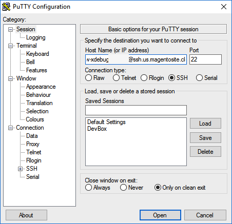

# Configurar Xdebug

[!DNL Xdebug] es una extensión para depurar su PHP. Aunque puede utilizar un IDE de su elección, a continuación se explica cómo configurar [!DNL Xdebug] y [!DNL PhpStorm] para depurar en el entorno local.

>[!NOTE]
>
>Puede configurar [!DNL Xdebug] para que se ejecute en el entorno de Cloud Docker para la depuración local sin cambiar la configuración del proyecto de Adobe Commerce en la infraestructura en la nube. Consulte [Configurar Xdebug para Docker](https://developer.adobe.com/commerce/cloud-tools/docker/test/configure-xdebug).

Para habilitar [!DNL Xdebug], debe configurar un archivo en el repositorio Git, configurar el IDE y configurar el reenvío de puertos. Puede establecer algunas opciones en el archivo `magento.app.yaml`. Después de editar, inserte los cambios de Git en todos los entornos de Starter y de integración de Pro para habilitar [!DNL Xdebug]. [!DNL Xdebug] ya está disponible en los entornos de ensayo y producción de Pro.

Una vez configurados, puede depurar los comandos de CLI, las solicitudes web y el código. Recuerde que todos los entornos de infraestructura en la nube son de solo lectura. Clone el código en el entorno de desarrollo local para realizar la depuración. Para los entornos de ensayo y producción Pro, consulte [instrucciones adicionales](#debug-for-pro-staging-and-production) para [!DNL Xdebug].

## Requisitos

Para ejecutar y utilizar [!DNL Xdebug], necesita la URL SSH para el entorno. Puede encontrar la información a través de [[!DNL Cloud Console]](../project/overview.md) o de su [!DNL Cloud Onboarding UI].

## Configurar Xdebug

Para configurar [!DNL Xdebug], siga estos pasos:

- [Trabajar en una rama para insertar actualizaciones de archivos](#get-started-with-a-branch)
- [Habilitar [!DNL Xdebug] para entornos](#enable-xdebug-in-your-environment)
- [Configurar el servidor PHPStorm](#configure-phpstorm-server)
- [Configuración del reenvío de puertos](#set-up-port-forwarding)

### Introducción a una rama

Para agregar [!DNL Xdebug], Adobe recomienda trabajar en [una rama de desarrollo](../dev-tools/cloud-cli-overview.md#create-an-environment-branch).

### Habilitar Xdebug en su entorno

Puede habilitar [!DNL Xdebug] directamente en todos los entornos de Starter y de integración de Pro. Este paso de configuración no es necesario para los entornos de ensayo y producción de Pro. Consulte [Depurar para ensayo y producción profesional](#debug-for-pro-staging-and-production).

>[!VIDEO](https://video.tv.adobe.com/v/3437407?learn=on)

Para habilitar [!DNL Xdebug] en su proyecto, agregue `xdebug` a la sección `runtime:extensions` del archivo `.magento.app.yaml`.

**Para habilitar Xdebug**:

1. En el terminal local, abra el archivo `.magento.app.yaml` en un editor de texto.

1. En la sección `runtime`, en `extensions`, agregue `xdebug`. Por ejemplo:

   ```yaml
   runtime:
       extensions:
           - redis
           - xsl
           - newrelic
           - sodium
           - xdebug
   ```

1. Guarde los cambios en el archivo `.magento.app.yaml` y salga del editor de texto.

1. Agregue, confirme e inserte los cambios para volver a implementar el entorno.

   ```bash
   git add .magento.app.yaml
   ```

   ```bash
   git commit -m "add xdebug"
   ```

   ```bash
   git push origin <environment-ID>
   ```

Cuando se implementa en entornos Starter y entornos de integración Pro, [!DNL Xdebug] ya está disponible. Continúe configurando el IDE. Para PhpStorm, consulte [Configurar PhpStorm](#configure-phpstorm).

### Configurar el servidor PhpStorm

>[!VIDEO](https://video.tv.adobe.com/v/3437409?learn=on)

El IDE [PhpStorm](https://www.jetbrains.com/phpstorm/) debe estar configurado para funcionar correctamente con [!DNL Xdebug].

**Para configurar PhpStorm para que funcione con Xdebug**:

1. En su proyecto PhpStorm, abra el panel **Configuración**.

   - _macOS_—Seleccione **PhpStorm** > **Configuración**.
   - _Windows/Linux_—Seleccione **Archivo** > **Configuración**.

1. En el panel _Configuración_, expanda la sección **PHP** y haga clic en **Servidores**.

1. Haga clic en **+** para agregar una configuración de servidor. El nombre del proyecto aparece en gris en la parte superior.

1. [Opcional] Configure las siguientes opciones para la nueva configuración del servidor. Consulte [No se ha configurado ningún servidor de depuración](https://www.jetbrains.com/help/phpstorm/troubleshooting-php-debugging.html#no-debug-server-is-configured) en la documentación de _PHPStorm_.

   - **Nombre**: escriba el mismo nombre que el nombre de host. Este valor debe coincidir con el valor de la variable `PHP_IDE_CONFIG` en [Depurar comandos CLI](#debug-cli-commands) para usar CLI para la depuración.
   - **Host**: escriba el nombre de host.
   - **Puerto**—Escriba `443`.
   - **Debugger**: seleccione `Xdebug`.

1. Seleccionar **Usar asignaciones de ruta**. En el panel _Archivo/Directorio_, se muestra la raíz del proyecto para `serverName`.

1. En la columna **Ruta absoluta en el servidor**, haga clic en el icono **Editar** y agregue una configuración basada en el entorno.

   - La ruta remota es `/app` para todos los entornos de Starter y de Pro Integration.
   - Para entornos de ensayo y producción Pro:

      - Producción: `/app/<project_code>/`
      - Ensayo: `/app/<project_code>_stg/`

1. Cambie el puerto [!DNL Xdebug] a `9000,9003` o puede limitarlo a `9000` en el panel **PHP** > **Depurar** > **Xdebug** > **Puerto de depuración**.

1. Haga clic en **Aplicar**.

### Crear la configuración de ejecución/depuración de PHPStorm

Esto permite que la aplicación tenga la configuración de depuración correcta para controlar la solicitud de la aplicación de Adobe Commerce.

>[!VIDEO](https://video.tv.adobe.com/v/3437426?learn=on)

1. Abra la aplicación PHPStorm y haga clic en **[!UICONTROL Add Configuration]** en la parte superior derecha de la pantalla.

1. Haga clic en **[!UICONTROL Add new run configuration]**.

1. Seleccione la opción **[!UICONTROL PHP Remote Debug]**.

   - Introduzca un nombre único, pero reconocible.
   - Marque la casilla [!UICONTROL Filter debug connection by IDE key]**.
   - Seleccione el servidor que creó en la [sección anterior](#configure-phpstorm-server). Si aún no lo ha creado, puede crear uno ahora, pero consulte esa parte de la guía de configuración.
   - En el campo de texto **[!UICONTROL IDE key(session id)]**, escriba `PHPSTORM` en mayúsculas. Lo utilizaremos en otras partes de la configuración, por lo que es importante mantener esto mismo. Si elige otra cadena, recuerde usarla en cualquier otra parte del proceso de instalación y configuración.

1. Haga clic en **[!UICONTROL Apply]** > **[!UICONTROL OK]**.

### Configuración del reenvío de puertos

>[!VIDEO](https://video.tv.adobe.com/v/3437410?learn=on)

Asigne la conexión `XDEBUG` del servidor al sistema local. Para realizar cualquier tipo de depuración, debe reenviar el puerto 9000 desde el servidor de Adobe Commerce en la nube a su equipo local. Consulte una de las siguientes secciones:

- [Reenvío de puertos en Mac o UNIX](#port-forwarding-on-mac-or-unix)
- [Reenvío de puertos en Windows](#port-forwarding-on-windows)

#### Reenvío de puertos en Mac o UNIX®

**Para configurar el reenvío de puertos en un entorno Mac o UNIX®**:

1. Abra un terminal.

1. Utilice SSH para establecer la conexión.

   ```bash
   ssh -R 9000:localhost:9000 <ssh url>
   ```

   Utilice la opción `-v` (detallada) para que cuando un socket esté conectado al puerto que se está reenviando, se muestre en el terminal.

   Si se muestra el error &quot;no se puede conectar&quot; o &quot;no se pudo escuchar el puerto en remoto&quot;, podría haber otra sesión SSH activa en el servidor que está ocupando el puerto 9000. Si esa conexión no se está utilizando, puede terminarla.

**Para solucionar problemas de conexión**:

1. Utilice SSH para iniciar sesión en el entorno de integración, ensayo o producción remoto.

1. Ver una lista de sesiones SSH: `who`

1. Ver sesiones SSH existentes por usuario. ¡Tenga cuidado de no afectar a un usuario que no sea usted!

   - integración: los nombres de usuario son similares a `dd2q5ct7mhgus`
   - Ensayo: los nombres de usuario son similares a `dd2q5ct7mhgus_stg`
   - Producción: los nombres de usuario son similares a `dd2q5ct7mhgus`

1. Para una sesión de usuario anterior a la suya, busque el valor de pseudoterminal (PTS), como `pts/0`.

1. Elimine el ID de proceso (PID) correspondiente al valor PTS.

   ```bash
   ps aux | grep ssh
   kill <PID>
   ```

   Respuesta de ejemplo:

   ```
   dd2q5ct7mhgus        5504  0.0  0.0  82612  3664 ?      S    18:45   0:00 sshd: dd2q5ct7mhgus@pts/0
   ```

   Para finalizar la conexión, introduzca un comando kill con el ID de proceso (PID).

   ```bash
   kill 3664
   ```

#### Reenvío de puertos en Windows

Para configurar el reenvío de puertos (túnel SSH) en Windows, debe configurar la aplicación de terminal de Windows. En este ejemplo se explica cómo crear un túnel SSH con [Putty](https://www.chiark.greenend.org.uk/~sgtatham/putty/latest.html). Puede utilizar otras aplicaciones como Cygwin. Para obtener más información sobre otras aplicaciones, consulte la documentación del proveedor proporcionada con esas aplicaciones.

**Para configurar un túnel SSH en Windows usando Putty**:

1. Si aún no lo ha hecho, descargue [Putty](https://www.chiark.greenend.org.uk/~sgtatham/putty/latest.html).

1. Iniciar Masilla.

1. En el panel Categoría, haga clic en **Sesión**.

1. Introduzca la siguiente información:

   - Campo **Nombre de host (o dirección IP)**: Escriba la [URL SSH](../development/secure-connections.md#connect-to-a-remote-environment) para su servidor en la nube
   - Campo de **puerto**: escriba `22`

   

1. En el panel _Categoría_, haga clic en **Conexión** > **SSH** > **Túneles**.

1. Introduzca la siguiente información:

   - Campo de **puerto Source**: escriba `9000`
   - Campo **Destino**: escriba `127.0.0.1:9000`
   - Haga clic en **Remoto**

1. Haga clic en **Agregar**.

   

1. En el panel _Categoría_, haga clic en **Sesión**.

1. En el campo **Sesiones guardadas**, escriba un nombre para este túnel SSH.

1. Haga clic en **Guardar**.

   

1. Para probar el túnel SSH, haz clic en **Cargar** y luego haz clic en **Abrir**.

   Si aparece el error &quot;no se puede conectar&quot;, compruebe lo siguiente:

   - Todos los ajustes de Masilla son correctos
   - Está ejecutando Putty en el equipo en el que se encuentran las claves SSH de su Adobe Commerce privado en la infraestructura de la nube

## Acceso SSH a entornos Xdebug

Para iniciar la depuración, realizar la configuración y mucho más, necesita los comandos SSH para acceder a los entornos. Puede obtener esta información a través de [[!DNL Cloud Console]](../development/secure-connections.md#use-an-ssh-command) y la hoja de cálculo del proyecto.

Para entornos Starter y entornos de integración Pro, puede utilizar el siguiente comando CLI `magento-cloud` para SSH en esos entornos:

```bash
magento-cloud environment:ssh --pipe -e <environment-ID>
```

Para usar [!DNL Xdebug], SSH debe conectarse al entorno de la siguiente manera:

```bash
ssh -R <xdebug listen port>:<host>:<xdebug listen port> <SSH-URL>
```

Por ejemplo,

```bash
ssh -R 9000:localhost:9000 pwga8A0bhuk7o-mybranch@ssh.us.magentosite.cloud
```

## Depurar para ensayo y producción profesionales

>[!NOTE]
>
>En entornos de ensayo y producción Pro, [!DNL Xdebug] siempre está disponible, ya que estos entornos tienen una configuración especial para [!DNL Xdebug]. Todas las solicitudes web normales se dirigen a un proceso PHP dedicado que no tiene [!DNL Xdebug]. Por lo tanto, estas solicitudes se procesan normalmente y no están sujetas a la degradación del rendimiento cuando se carga [!DNL Xdebug]. Cuando se envía una solicitud web que tiene la clave [!DNL Xdebug], se enruta a un proceso PHP independiente que tiene [!DNL Xdebug] cargado.

Para usar [!DNL Xdebug] específicamente en el entorno de ensayo y producción de plan Pro, cree un túnel SSH y una sesión web independientes a los que solo tenga acceso. Este uso difiere del acceso habitual, ya que solo proporciona acceso a usted y no a todos los usuarios.

Necesita lo siguiente:

- Comandos SSH para acceder a los entornos. Puede obtener esta información a través de [[!DNL Cloud Console]](../project/overview.md) o de su [!DNL Cloud Onboarding UI].
- El valor `xdebug_key` establecido al configurar los entornos Staging y Pro.

  `xdebug_key` se puede encontrar utilizando SSH para iniciar sesión en el nodo principal y ejecutar:

  ```bash
  cat /etc/platform/*/nginx.conf | grep xdebug.sock | head -n1
  ```

**Para configurar un túnel SSH en un entorno de ensayo o producción**:

1. Abra un terminal.

1. Limpie todas las sesiones SSH de cada nodo web del clúster.

   ```bash
   ssh USERNAME@CLUSTER.ent.magento.cloud 'rm /run/platform/USERNAME/xdebug.sock'
   ```

1. Configure el túnel SSH para Xdebug para cada nodo web del clúster.

   ```bash
   ssh -R /run/platform/USERNAME/xdebug.sock:localhost:9000 -N USERNAME@CLUSTER.ent.magento.cloud
   ```

>[!NOTE]
>
>Para obtener el valor correcto de `USERNAME@CLUSTER.ent.magento.cloud`:
>- Método 1: CLI de magento en la nube: `magento-cloud ssh --all`
>- Método 2: consola Commerce: https://CONSOLE-URL/ENVIRONMENT, haga clic en el menú desplegable `SSH v`

**Para iniciar la depuración con la URL del entorno**:

Esta es una demostración de las configuraciones utilizadas, así como una demostración del parámetro GET para iniciar una sesión de depuración remota.

>[!VIDEO](https://video.tv.adobe.com/v/3437417?learn=on)

1. Habilite la depuración remota; visite el sitio en el explorador y agregue lo siguiente a la dirección URL donde `KEY` es el valor de `xdebug_key`.

   ```http
   ?XDEBUG_SESSION_START=KEY
   ```

   Este paso establece la cookie que envía las solicitudes del explorador al déclencheur [!DNL Xdebug].

1. Complete la depuración con [!DNL Xdebug].

1. Cuando esté listo para finalizar la sesión, utilice el siguiente comando para quitar la cookie y finalizar la depuración a través del explorador donde `KEY` es el valor de `xdebug_key`.

   ```http
   ?XDEBUG_SESSION_STOP=KEY
   ```

   >[!NOTE]
   >
   >No se admiten las `XDEBUG_SESSION_START` pasadas por `POST` solicitudes.

## Depurar comandos CLI

En esta sección se explican los comandos de CLI de depuración.

Para depurar comandos CLI:

1. SSH en el servidor que desea depurar mediante comandos CLI.

1. Cree las siguientes variables de entorno:

   ```bash
   export XDEBUG_CONFIG='PHPSTORM'
   ```

   ```bash
   export PHP_IDE_CONFIG="serverName=<name of the server that is configured in PHPSTORM>"
   ```

   Estas variables se eliminan cuando finaliza la sesión SSH.

1. Comenzar depuración

   En entornos Starter y entornos de integración Pro, ejecute el comando CLI para depurar.
Puede añadir opciones de tiempo de ejecución, por ejemplo:

   ```bash
   php -d xdebug.profiler_enable=On -d xdebug.max_nesting_level=9999 bin/magento cache:clean
   ```

   En entornos de ensayo y producción Pro, debe especificar la ruta al archivo de configuración PHP [!DNL Xdebug] al depurar comandos CLI, por ejemplo:

   ```bash
   php -c /etc/platform/USERNAME/php.xdebug.ini bin/magento cache:clean
   ```

## Depuración de solicitudes web

Los siguientes pasos le ayudan a depurar solicitudes web.

1. En el menú _Extensión_, haga clic en **Depurar** para habilitar.

1. Haga clic con el botón derecho, seleccione el menú de opciones y establezca la clave IDE en **PHPSTORM**.

1. Instale el cliente [!DNL Xdebug] en el explorador. Configúrelo y actívelo.

### Ejemplo: configuración de Chrome

En esta sección se explica cómo usar [!DNL Xdebug] en Chrome con la extensión [!DNL Xdebug] Helper. Para obtener información acerca de las herramientas de [!DNL Xdebug] para otros exploradores, consulte la documentación del explorador.

**Para usar el Asistente de Xdebug con Chrome**:

1. Cree un [túnel SSH](#ssh-access-to-xdebug-environments) al servidor en la nube.

1. Instale la [extensión Xdebug Helper](https://chromewebstore.google.com/detail/eadndfjplgieldjbigjakmdgkmoaaaoc) desde el almacén de Chrome.

1. Habilite la extensión en Chrome como se muestra en la siguiente figura.

   

1. En Chrome, haga clic con el botón derecho en el icono verde de ayuda en la barra de herramientas de Chrome.

1. En el menú emergente, haga clic en **Opciones**.

1. En la lista _Clave IDE_, haga clic en **PhpStorm**.

1. Haga clic en **Guardar**.

   

1. Abra el proyecto PhpStorm.

1. En la barra de navegación superior, haga clic en el icono **Comenzar a escuchar**.

   Si no se muestra la barra de navegación, haga clic en **Ver** > **Barra de navegación**.

1. En el panel de navegación de PhpStorm, haga doble clic en el archivo PHP que desea probar.

## Depuración del código local

Debido a los entornos de solo lectura, debe extraer el código de la estación de trabajo local desde un entorno o rama Git específica para realizar la depuración.

El método que elija depende de usted. Tiene las siguientes opciones:

- Compruebe el código de Git y ejecute `composer install`

  Este método funciona a menos que `composer.json` haga referencia a paquetes en repositorios privados a los que no tiene acceso. Este método resulta en obtener toda la base de código de Adobe Commerce.

- Copie los directorios `vendor`, `app`, `pub`, `lib` y `setup`

  Este método hace que tenga todo el código que pueda probar. Según el número de recursos estáticos que tenga, podría resultar en una transferencia larga con un gran volumen de archivos.

- Copiar solo el directorio `vendor`

  Debido a que la mayor parte del código se encuentra en el directorio `vendor`, es probable que este método genere buenas pruebas, aunque no se esté probando toda la base de código.

**Para comprimir archivos y copiarlos en el equipo local**:

1. Utilice SSH para iniciar sesión en el entorno remoto.

1. Comprima los archivos.

   ```bash
   tar -czf /tmp/<file-name>.tgz <directory list>
   ```

   Por ejemplo, para comprimir solo el directorio `vendor`:

   ```bash
   tar -czf /tmp/vendor.tgz vendor
   ```

1. En su entorno local, utilice PhpStorm para comprimir los archivos.

   ```bash
   cd <phpstorm project root dir>
   ```

   ```bash
   rsync <SSH-URL>:/tmp/<file-name>.tgz .
   ```

   ```bash
   tar xzf <file-name>.tgz
   ```
